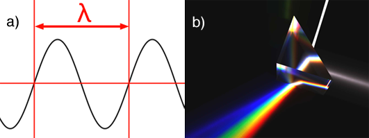
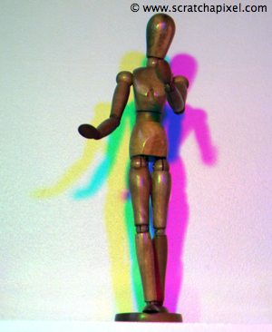

# Introduction to Light, Color and Color Space

## Introduction

Simple en apparence et assez courante, la notion de couleur est en réalité une question complexe. Ce n'est pas seulement quelque chose qui peut être décrit scientifiquement, auquel cas nous ne pourrions avoir qu'une point de vue objectif et rationnel sur la question.

Les couleurs sont également le résultat d'un processus qui implique la vision, l'un des systèmes sensoriels à travers lesquels nous percevons et interagissons avec le monde qui nous entoure. 

En tant que tel, c'est aussi une question très subjective avec une composante psychologique (la signification des couleurs) et physiologique (comment notre cerveau traite-t-il les couleurs) (avez-vous déjà vécu une dispute avec une autre personne à propos de la couleur d'un objet ?).

Vous avez aussi probablement tous été trompés par des illusions d'optique bien connues qui sont un autre exemple de l'influence de l'esprit sur la façon dont nous percevons les formes et les couleurs.

Nous n'entrerons pas dans les détails et nous nous en tiendrons à la façon dont nous pouvons représenter, stocker et afficher les couleurs dans le monde des ordinateurs. Cependant, c'est juste pour dire que le sujet est beaucoup plus complexe qu'il n'y paraît à première vue.

L'étude de la couleur est généralement appelée **science des couleurs**, qui comprend tous les éléments que nous avons mentionnés ci-dessus : 

- [x] Comment le cerveau traite-t-il les stimuli visuels en ce que nous percevons comme des couleurs.
- [x] L'utilisation des couleurs d'un point de vue artistique et l'étude de ondes électromagnétiques responsables de la lumière telle qu'elle existe dans le monde physique.
- [x] Traiter les couleurs dans le domaine des écrans numériques, qui est aussi une science à part entière (ce que l'on appelle parfois la **gestion des couleurs**).

## Light

Tout commence par la lumière. Avant de pouvoir nous pencher sur les couleurs, nous devons d'abord comprendre la lumière et comment la lumière interagit avec la matière.

La lumière voyage dans l'espace sous forme d'ondes électromagnétiques, mais peut également être décrite comme un flux de particules qu'Einstein appelait photons (c'est la raison pour laquelle nous disons que la lumière a une double nature onde-particule).
Dans cette leçon cependant, nous ne considérerons la lumière que sous sa forme ondulatoire.

Une onde périodique, comme nous le savons, est définie par sa fréquence (le nombre de fois qu'un cycle est répété par unité de temps) ou sa longueur d'onde (qui est l'inverse de la fréquence) qui est la distance sur laquelle la forme de l'onde se répète.

La couleur de la lumière peut être considérée comme l'équivalent du concept de hauteur du son. Les deux sont basés sur la longueur d'onde ou la fréquence du signal voyageant dans l'espace (consultez la leçon sur l'interaction lumière-matière pour en savoir plus sur la longueur d'onde et la fréquence de la lumière).

<figcaption style="font-size:12px">
<b>Figure 1:</b>a) the length a complete cycle of the wave is called the wavelength of the periodic function. 
       The wavelength of visible light varies from 380 nm to 740 nm. 
    b) white light passing through a prism is decomposed into a rainbow of colors.
</figcaption>
   

A wavelength is denoted with the greek letter λ (lambda). Visible light is made of waves which frequency varies from 380 to about 740 nanometres (a nanometre is 1×10−9 meter). Any waves which wavelength is below 380 nm or above 740 nm can not be perceived by the human eye. The following image shows the full spectrum of colors the visible light spectrum is made of (each color you see has a wavelength within the range of about 380 nm to 780 nm)

Most people are also familiar with the Newton experiment which consists of using a prism to decompose white light into a rainbow of colors (figure 1b).

This experiment shows that white light is made of all the visible colors from the visible light spectrum, mixed in some proportions. 
The prism experiment can also be carried out the other way around. If we take all the light colors from the visible light spectrum and add them up in the same proportions, then we can recreate white light (figure 2). 

White light as such doesn't exist. White light is the result of a light source, the sun or the screen of your computer, producing a mixture of light colors from the visible spectrum. 

If you examine your computer screen or television with a magnifying glass, you will see tiny dots, probably red, green and blue and by mixing these colors in different amounts, a large range of colors can be produced.

<figcaption style="font-size:12px">
<b>Figure 2:</b>a wooden mannequin lit by a green, red and blue light. The three colors are mixed on the background which appears     white.
</figcaption>
   
!!! info
	Pointillism is a painting technique by which sensations of colors can be obtained by putting small dots of pure colors side 		by side in organised patterns rather than using the more traditional way of mixing colors on the palette. 
	From the distance, the colored dots blend into one single color. Screens work in very similar fashion. Each pixel from the 		scene is actually made of three small components which emit red, green and blue light. 

	By changing the amount of red, green and blue light emitted, we can create all the colors we need. From the distance these 		three separable elements are indistinguishable and the contribution of each light blend within each other to form one single 		light color.
	The next chapter will provide more information on the way screens actually work.
	

